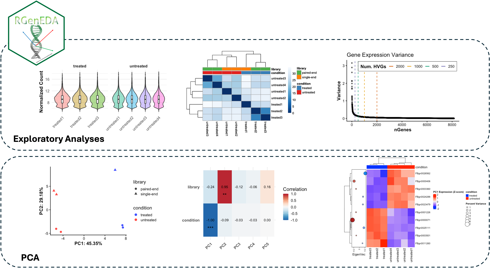

# RGenEDA 
**Clean, unified, streamlined, and reproducible frameworks for genomic exploratory data analyses**  


 <!-- badges: start -->
  
 
 
  [](https://github.com/mikemartinez99/RGenEDA/actions/workflows/R-CMD-check.yaml)
  [](https://app.codecov.io/gh/mikemartinez99/RGenEDA)
  <!-- badges: end -->


### Development <!-- omit in toc -->

> [!IMPORTANT]
> **RenEDA is currently under active development. If there is a feature you would like implemented, please submit a feature request on the Issues page of submit a pull request. For information on new additions see the** **[Change Log](#change-log)**

--- 




## Installation
Install the latest version from Github

```r
install.packages("devtools") # if not already instaled

library(devtools)
devtools::install_github("mikemartinez99/RGenEDA")

library(RGenEDA)

```

## Usage
For a full demo, see [Pasilla Dataset Demo](https://github.com/mikemartinez99/RGenEDA/blob/main/vignettes/introduction.md)


## Change-log

**** ****  
*April 2025*   
  - Implemented core, standalone functions
    - Variance calculation, PCA calculation, and Eucliden distances, and Eigenvector correlations

**** ****  
*October 16th, 2025* 
  - Introduced S4 **GenEDA** object for streamlined data handling
  - Added **methods** for HVG calculation and PCA storage within S4 slots.
  - Added **visualization functions**
    - PCA plots
    - Variance plots for HVGs
    - Eigenvector (gene-loading) plots
  - Revamped eigencorrelation plots to only use top number of HVGs identified in HVG selection/PCA
  - Enhanced plot output flexibility (return **ggplot2, pheatmap**, or **ComplexHeatmap** objects for full customization
  - Added **unit tests**
  - Added **Pasilla dataset vignette**

**** ****    
*November 3rd, 2025*  
  - Rely soley on **Pheatmap** for all heatmap visualizations
  - Fixed top-gene-loading bug for selected PCs in PlotEigenHeatmap function
  - Added optional **DEGs slot** to GenEDA object to interface with **DESeq2**
  - Added **MA plot** functionality

**** ****      
*November 10th, 2025*  
  - Fixed example blocks in roxygen headers
  - Addressed all R cmd build errors, warnings, and notes

## 📬 Contact
Mike Martinez M.S. - Dartmouth Genomic Data Science Core

f007qps@dartmouth.edu


