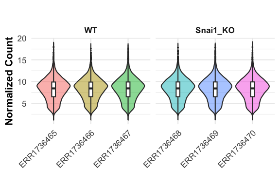
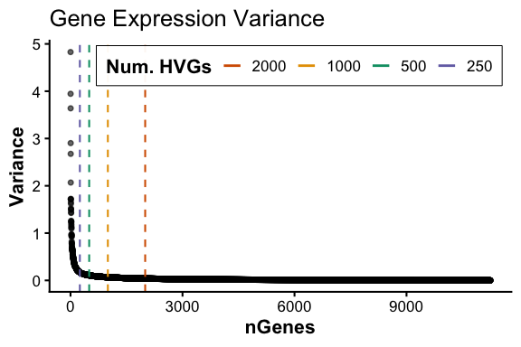
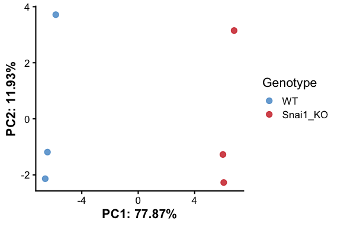
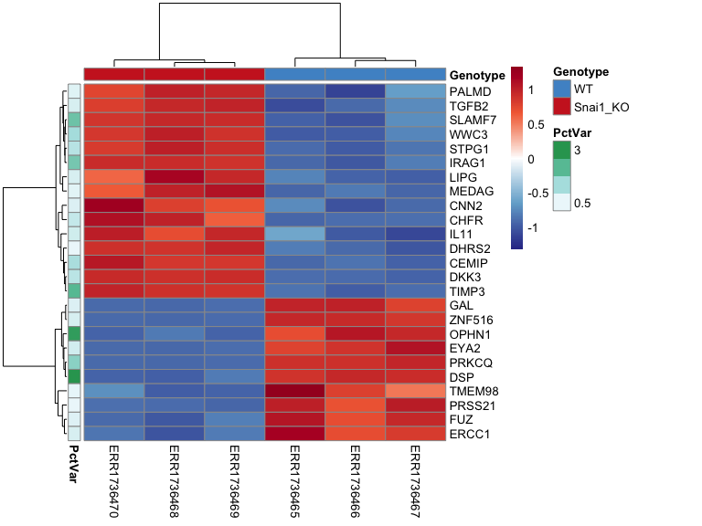
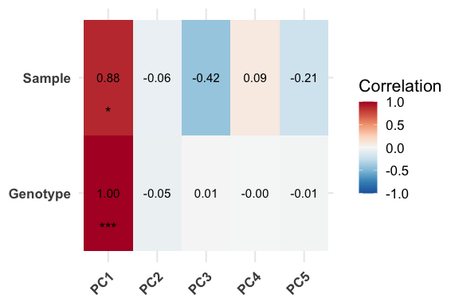
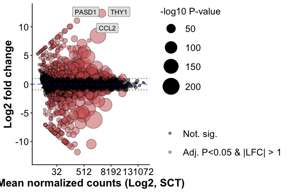
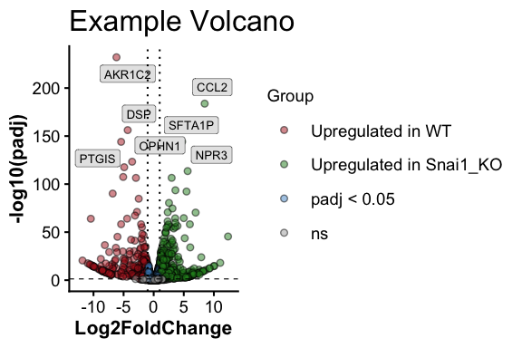

# Overview

`RGenEDA` is designed to provide a streamlined, unified and reproducible
framework for exploratory data analysis across multiple omics data
types. This vignette introduces the key components of the `RGenEDA`
package using bulk RNA-seq data from the paper [Genomewide binding of
transcription factor Snail1 in triple-negative breast cancer
cell](https://pubmed.ncbi.nlm.nih.gov/29729076/) (Maturi, et al. 2018).
Raw counts and metadata were obtained from [The Gene Expression
Atlas](https://www.ebi.ac.uk/gxa/experiments/E-MTAB-5244/Downloads)
under ENA:ERP019920, E-MTAB-5244.

The data has be pre-wrangled but the standard [deseq2
framework](https://www.bioconductor.org/packages/devel/bioc/vignettes/DESeq2/inst/doc/DESeq2.html)
will be applied here to demonstrate the functionality of `RGenEDA`.

The paper explores epithelial cell line HS578T. The authors have
introduced a knock-out of the Snail1 transcription factor and compare
these with wild-type (WT) HS578T cells.

## Table of contents

-   [Load and inspect the data](#load-and-inspect-the-data)
-   [Define metadata](#define-metadata)
-   [Processing and normalization](#processing-and-normalization)
-   [Create a GenEDA object](#create-a-geneda-object)
-   [Count distrubutions across
    samples](#count-distributions-across-samples)
-   [Sample Eucliden distances with hierarchical
    clustering](#sample-euclidean-distances-with-hierarchical-clustering)
-   [Identify highly variable genes](#identify-highly-variable-genes)
-   [Principal component analysis](#principal-component-analysis)
-   [Extract and visualize PCA
    results](#extract-and-visualize-pca-results)
-   [Explore Eigen vectors of individual
    PCs](#explore-eigen-vectors-of-individual-pcs)
-   [Correlate PCs with metadata](#correlate-pcs-with-metadata)
-   [Explore DEGs](#explore-degs)

## Load and inspect the data

Data has been included in this package for your convenience. It can be
easily accessed using the following commands. Here, we have one key
variable of interest (Genotype) for simplicity sake (though your
experiment may have many. `RGenEDA` can handle any number of
covariates.)

    # Load the counts and metadata and extract
    data("Snail1KO")
    counts <- Snail1KO[["rawCounts"]]
    metadata <- Snail1KO[["metadata"]]

    # Sanity check
    head(counts)[1:6, 1:6]
    #>          ERR1736465 ERR1736466 ERR1736467 ERR1736468 ERR1736469 ERR1736470
    #> TSPAN6          434        829        334        779        578        602
    #> TNMD              0          0          0          0          0          0
    #> DPM1           2202       3461       1627       4241       3676       3946
    #> SCYL3            45         72         31        119         69         92
    #> C1orf112        320        558        235        516        468        417
    #> FGR               0         10          0          0          0          0
    head(metadata)
    #>                Sample          Disease Genotype        CellLine_CellType
    #> ERR1736465 ERR1736465 breast carcinoma       WT HS578T - epithelial cell
    #> ERR1736466 ERR1736466 breast carcinoma       WT HS578T - epithelial cell
    #> ERR1736467 ERR1736467 breast carcinoma       WT HS578T - epithelial cell
    #> ERR1736468 ERR1736468 breast carcinoma Snai1_KO HS578T - epithelial cell
    #> ERR1736469 ERR1736469 breast carcinoma Snai1_KO HS578T - epithelial cell
    #> ERR1736470 ERR1736470 breast carcinoma Snai1_KO HS578T - epithelial cell

It is helpful to establish color palettes early on in an exploratory
analysis to keep figures consistent. `RGenEDA` uses the list of named
vectors convention for creating color vectors for plotting functions.

    # Color palettes for plotting
    colorList <- list(
      Genotype = c("WT" = "steelblue3", "Snai1_KO" = "firebrick3"))

## Processing and normalization

The standard DESeq2 workflow can now be applied. The end goal is to
obtain normalized counts and differential expression results. Lowly
expressed genes are filtered out before running `DESeq2.`

    # Ensure tables are not scrambled
    all(colnames(counts) == rownames(metadata))
    #> [1] TRUE

    dds <- DESeqDataSetFromMatrix(
      countData = counts,
      colData = metadata,
      design = ~ Genotype
    )
    #> Warning in DESeqDataSet(se, design = design, ignoreRank): some variables in design formula are characters, converting to factors

    # Set reference levels
    dds$Genotype <- relevel(dds$Genotype, ref = "WT")

    # Pre-filter: keep genes with at least 10 counts in  at least 3 samples
    keep <- rowSums(counts(dds) >= 10) >= 3
    dds <- dds[keep,]

    # Run DESeq2
    dds <- DESeq(dds)

    # Rlog transform the data and extract normalized matrix
    rld <- rlog(dds)
    mat <- assay(rld)

## Create a GenEDA object

With the normalized counts and metadata prepared, a `GenEDA` object can
be initialized. This object will store all components of your analysis,
starting with normalized data and metadata (bare minimum requirements).

    # Factor metadata
    metadata$Genotype <- factor(metadata$Genotype, levels = c("WT", "Snai1_KO"))

    # Initialize GenEDA object with normalized counts and metadata
    obj <- GenEDA(
      normalized = mat,
      metadata = metadata)

    # View object summary
    obj
    #> geneda object
    #>   features: 11247
    #>   samples:  6
    #>   HVGs: 0
    #>   DimReduction: 0
    #>   counts: NULL
    #>   DEGs: NULL

You will see that the object also contains slots for Highly Variable
Genes (HVGs), DimReduction (PCA, etc..) and Differentially Expressed
Genes (DEGs). These will be populated shortly with `RGenEDA`

## Count distributions across samples

To visualize normalized count distributions across samples, the
`PlotCountDist()` function can be used. This is a quick and helpful way
to visualize effectiveness of normalization, as the overall
distributions should be similar across samples. Samples with very low or
very high overall counts compared to others might indicate problematic
samples, technical artifacts, or batch effect. This function returns a
`ggplot2` object to facilitate any additional customization.

    PlotCountDist(obj, split_by = "Genotype")

\## Sample Eucliden distances with hierarchical clustering

To visualize replicate similarity, Euclidean distances between samples
can be calculated and plotted as a `pheatmap` heatmap using the
`PlotDistances()` function. Darker colors indicate higher similarity,
while lighter colors represent dissimilar samples. This provides a quick
assessment of replicate quality and metadata features that drive
clustering. To save `pheatmap` objects within `RGenEDA`, we can use the
`GenSave()` function, which is similar in function to `ggsave()`.

    hm <- PlotDistances(
      obj,
      meta_cols = c("Genotype"),
      palettes = colorList,
      return = "plot"
    )
    hm$heatmap

    # GenSave(hm, "/path/to/EuclidenDistance_Heatmap.png", width = 6, height = 8)

\## Identify highly variable genes

Next, genes are ranked by decreasing variance to find highly variable
genes (HVGs) which most-likely drive biological differences. The full
variance profile curve for all genes profiled with `plotHVGVariance()`
as a means to pick a meaningful number of HVGs to retain for calculating
principal components in the next section.

    #----- Plot variance profile
    PlotHVGVariance(obj)

Based on the curve, 2,000 genes seems sufficient in capturing the
majority of variation. These genes can be extracted and retained in the
HVGs slot with `FindVariableFeatures()`

    #----- Add HVGs to object
    obj <- FindVariableFeatures(obj, 2000)

    #== Access HVGs (2 methods)
    # 1: Accessor function
    head(HVGs(obj))
    #> [1] "THY1"   "CCL2"   "SSX1"   "AKR1C2" "GPX1"   "MYL12B"

    # 2: Call the slot directly
    #head(obj@HVGs)

## Principal component analysis

Using the identified HVGs, principal components can be calculated using
`RunPCA()` This function stores PCA results in the DimReduction slot,
including:

• `$Loadings` (sample scores)

• `$Eigenvectors` (gene contributions)

• `$percent_var` (Percent variance explained per component, up to PC5)

If `FindVariableFeatures()` was not ran beforehand, `RunPCA` will
calculate HVGs by default with 2000 features. This argument can be
overriden directly using the `nfeatures` argument.

    obj <- RunPCA(obj)
    #> Calculating principal components from top 2000 HVGs
    #> Percent variations:
    #>       PC1       PC2       PC3       PC4       PC5 
    #> "77.87 %" "11.93 %"  "4.52 %"  "3.36 %"  "2.32 %"

    # DimReductions can be accessed with accessor function
    # head(DimReduction(obj))

    # Inspect PCA outputs
    head(obj@DimReduction$Loadings)
    #>                  PC1       PC2       PC3        PC4        PC5          PC6
    #> ERR1736465 -5.845179  3.716576  1.620623 -1.0955893  0.1772979 3.594429e-14
    #> ERR1736466 -6.433351 -1.186487  0.465169  2.4753119  0.2414526 3.577988e-14
    #> ERR1736467 -6.592484 -2.136361 -2.110072 -1.3682232 -0.3897501 3.589042e-14
    #> ERR1736468  6.063171 -2.271587  0.822507 -0.6827020  1.7746208 3.570818e-14
    #> ERR1736469  6.007254 -1.272494  1.265257 -0.0950531 -1.9236799 3.560521e-14
    #> ERR1736470  6.800590  3.150352 -2.063484  0.7662558  0.1200585 3.591129e-14
    head(obj@DimReduction$Eigenvectors)
    #>                  PC1         PC2           PC3          PC4          PC5
    #> CENPI    0.003588589 -0.02172881 -0.0196200153 -0.015192540 -0.005752305
    #> TULP3    0.021586498 -0.02096203  0.0134327078 -0.016091133  0.033236356
    #> MAP3K14  0.021846399  0.04358180 -0.0447224066 -0.022827314 -0.064475180
    #> AP3D1    0.026800954  0.02836574 -0.0380992712 -0.006296689  0.006278297
    #> DIP2B   -0.002712758 -0.01559409 -0.0310157471 -0.028917713  0.008953505
    #> TAZ      0.003357044  0.01302154 -0.0009023767 -0.003193418 -0.005208482
    head(obj@DimReduction$percent_var)
    #>       PC1       PC2       PC3       PC4       PC5 
    #> "77.87 %" "11.93 %"  "4.52 %"  "3.36 %"  "2.32 %"

## Extract and visualize PCA results

PCA results merged with metadata can easily be extracted using
`ExtractPCA()` which enables flexible plotting. For convenience,
`PlotPCA()` allows a quick visualization which can also be further
customized with `ggplot2`.

    pcaDF <- ExtractPCA(obj)
    head(pcaDF)
    #>                  PC1       PC2       PC3        PC4        PC5          PC6     Sample          Disease Genotype
    #> ERR1736465 -5.845179  3.716576  1.620623 -1.0955893  0.1772979 3.594429e-14 ERR1736465 breast carcinoma       WT
    #> ERR1736466 -6.433351 -1.186487  0.465169  2.4753119  0.2414526 3.577988e-14 ERR1736466 breast carcinoma       WT
    #> ERR1736467 -6.592484 -2.136361 -2.110072 -1.3682232 -0.3897501 3.589042e-14 ERR1736467 breast carcinoma       WT
    #> ERR1736468  6.063171 -2.271587  0.822507 -0.6827020  1.7746208 3.570818e-14 ERR1736468 breast carcinoma Snai1_KO
    #> ERR1736469  6.007254 -1.272494  1.265257 -0.0950531 -1.9236799 3.560521e-14 ERR1736469 breast carcinoma Snai1_KO
    #> ERR1736470  6.800590  3.150352 -2.063484  0.7662558  0.1200585 3.591129e-14 ERR1736470 breast carcinoma Snai1_KO
    #>                   CellLine_CellType
    #> ERR1736465 HS578T - epithelial cell
    #> ERR1736466 HS578T - epithelial cell
    #> ERR1736467 HS578T - epithelial cell
    #> ERR1736468 HS578T - epithelial cell
    #> ERR1736469 HS578T - epithelial cell
    #> ERR1736470 HS578T - epithelial cell

    # Plot PCA
    PlotPCA(object = obj,
            x = 1,
            y = 2,
            color_by = "Genotype",
            colors = c("WT" = "steelblue3", "Snai1_KO" = "firebrick3"))

## Explore Eigen vectors of individual PCs

The individual Eigenvectors (genes) that comprise a particular component
of interest can be extracted and their Z-scaled normalized expression
visualized as a heatmap annotated by the percent variation explained
using `extractEigen()` and `PlotEigenHeatmap()`. This can again identify
sample-to-sample differences.

    pc1_eigen <- extractEigen(object = obj,
                              component = "PC1")
    head(pc1_eigen)
    #>      Gene  EigenVector       PctVar
    #> 1   CENPI  0.003588589 0.0012877974
    #> 2   TULP3  0.021586498 0.0465976905
    #> 3 MAP3K14  0.021846399 0.0477265145
    #> 4   AP3D1  0.026800954 0.0718291147
    #> 5   DIP2B -0.002712758 0.0007359055
    #> 6     TAZ  0.003357044 0.0011269741

    hm2 <- PlotEigenHeatmap(obj,
                     pc = "PC1",
                     n = 25,
                     annotate_by = "Genotype",
                     annotate_colors = colorList)
    hm2$heatmap

    # GenSave(hm2, "/path/to/EuclidenDistance_Heatmap.png", width = 6, height = 8)

## Correlate PCs with metadata

To interpret principal components, individual PCs can be correlated with
sample metadata using `PlotEigenCorr()`. This function computes Pearson
correlations and displays them as a heatmap, helping to reveal which
metadata features are most associated with major axes of variation. This
function returns a list of 4 elements:

• `$cor_matrix` (Pearson correlation values)

• `$pval_matrix` (Associated correlation p-values)

• `$stars` (asterisk representations of p-values)

• `$plot` (Eigencorr plot, as a `ggplot2` object, which can be saved
with `ggsave`)

**Note:** `PlotOrdCorr()` can be used for microbiome data as it
correlates metadata features with NMDS beta values rather than PCs.

    ec <- PlotEigenCorr(obj, num_pcs = 5)
    #> Warning in cor(x, y): the standard deviation is zero
    #> Warning in cor(x, y): the standard deviation is zero
    #> Warning in cor(x, y): the standard deviation is zero
    #> Warning in cor(x, y): the standard deviation is zero
    #> Warning in cor(x, y): the standard deviation is zero
    #> Warning in cor(x, y): the standard deviation is zero
    #> Warning in cor(x, y): the standard deviation is zero
    #> Warning in cor(x, y): the standard deviation is zero
    #> Warning in cor(x, y): the standard deviation is zero
    #> Warning in cor(x, y): the standard deviation is zero
    ec$plot

\## Explore DEGs

Differentially expressed genes can now be stored in the `RGenEDA`
object. `RGenEDA` was designed to directly work with DEG tables derived
from `DESeq2` and contain the column names “baseMean”, “log2FoldChange”
and “padj”. DEG tables from other packages can be used with some minor
dataframe manipulation.

Note: multiple DEG assays can be appended to the DEGs slot by passing an
assay name in the `SetDEGs()` command (for example, raw DESeq2 results
and Shrunk DESeq2 results.)

DEG assays can be filterd and directly saved as a new assay in the DEGs
slot using `FilterDEGs()`

    res <- results(dds) |> 
      as.data.frame()

    # Set a new DEG assay
    obj <- SetDEGs(object = obj, 
                   deg_table = res,
                   assay = "unfiltered")

    # Filter the DEG assay and save as a new one
    obj <- FilterDEGs(object = obj,
                      assay = "unfiltered",
                      padj_thresh = 0.05,
                      log2FC_thresh = 1,
                      saveAssay = "padj05_lfc1")

    # Grab results with accessor function
    nrow(DEGs(object = obj, assay = "unfiltered"))
    #> [1] 11247
    nrow(DEGs(object = obj, assay = "padj05_lfc1"))
    #> [1] 1198

Basic DEG visualizations plots such as MA plots and volcano plots can be
plotted using `PlotMA()` and `PlotVolcano()` “Num” and “Den” arguments
refer to numerator level and denominator level (reference level of
experiment, in our case, “WT”)

    PlotMA(obj,
           assay = "unfiltered",
           alpha = 0.05,
           fc = 1)
    #> Scale for size is already present.
    #> Adding another scale for size, which will replace the existing scale.
    #> Warning: Removed 5 rows containing missing values or values outside the scale range (`geom_point()`).
    #> Warning: ggrepel: 653 unlabeled data points (too many overlaps). Consider increasing max.overlaps
    #> Warning: ggrepel: 542 unlabeled data points (too many overlaps). Consider increasing max.overlaps

Or a volcano plot by specifying numerator and denominator (denominator
is your comparison reference level).

    PlotVolcano(obj,
           assay = "unfiltered", 
           alpha = 0.05,
           fc = 1,
           den = "WT",
           num = "Snai1_KO",
           title = "Example Volcano")
    #> Warning: ggrepel: 653 unlabeled data points (too many overlaps). Consider increasing max.overlaps
    #> Warning: ggrepel: 538 unlabeled data points (too many overlaps). Consider increasing max.overlaps

To explore whether a differentially expressed gene (DEG) is also a
highly variable gene (HVG), the intersect of these two vectors can be
taken to obtain highly variable DEGs (hvDEGs), which can be useful for
applications such as gene-set variation analysis (GSVA). To obtain this,
the `FindHVDEGs()` function can be used. The direction of fold change to
intersect with HVGs can be either “positive”, or “negative”, which
returns a vector of genes, or “both” which contains a list with
`$positive`, `$negative`, and `$both` slots.

    FindHVDEGs(obj, 
               assay = "padj05_lfc1",
               direction = "negative")
    #> 332 -log2FC hvDEGs found.
    #>   [1] "CAMKK1"       "ACSM3"        "TMEM98"       "DLX6"         "MAP3K9"       "PRSS21"       "FUZ"          "CEP68"       
    #>   [9] "ERCC1"        "BID"          "ABCC2"        "DEF6"         "LRRC7"        "VCAN"         "SPATA7"       "CAPG"        
    #>  [17] "MPC1"         "GUCY1B1"      "EYA2"         "ANKRD44"      "PRKCQ"        "MTHFD2"       "TRO"          "NAV3"        
    #>  [25] "MAST4"        "GAL"          "CLTCL1"       "DGCR2"        "MGAT4A"       "VASH1"        "ST6GAL1"      "ZNF532"      
    #>  [33] "TUBE1"        "MLH1"         "ARHGEF1"      "SLC1A3"       "OPHN1"        "CARMIL1"      "IGSF9B"       "CXCL2"       
    #>  [41] "MMP2"         "TESC"         "DLL3"         "DSP"          "SYDE2"        "PCSK5"        "TRMT2A"       "SMARCB1"     
    #>  [49] "PPM1F"        "SRRD"         "SEPTIN3"      "SYNGR1"       "PCK2"         "BMP7"         "ISM1"         "TRIB3"       
    #>  [57] "FERMT1"       "ZNF516"       "KLHL4"        "CPPED1"       "FZD3"         "JPH1"         "GDAP1"        "TUBB4A"      
    #>  [65] "FCGRT"        "NOVA2"        "OLFM2"        "TIMM50"       "DMAC2"        "CARD8"        "TMEM59L"      "SCN1B"       
    #>  [73] "CADM4"        "PTN"          "GIMAP2"       "TRIM14"       "KANK1"        "COL1A1"       "CLEC2B"       "PARP11"      
    #>  [81] "VDR"          "ADGRD1"       "PHC1"         "SOBP"         "PHACTR2"      "SEMA5A"       "GHR"          "PCDHB5"      
    #>  [89] "PCDHB6"       "CDH6"         "SLC12A7"      "EHHADH"       "PODXL2"       "ARHGEF26"     "EFEMP1"       "IL18R1"      
    #>  [97] "ID2"          "NOL10"        "SLC25A12"     "SDC1"         "ORC4"         "PAPPA2"       "RHOU"         "CTH"         
    #> [105] "AGMAT"        "ADGRL2"       "IFT46"        "MREG"         "UBE3D"        "TGIF2"        "ABCG2"        "LGALSL"      
    #> [113] "BCL11A"       "PCDHB12"      "RDH10"        "PDZRN3"       "KIAA1549"     "BAZ2B"        "PFKFB2"       "DAW1"        
    #> [121] "PTGIS"        "SNAI1"        "ZNF576"       "BMP4"         "EML2"         "TMX4"         "ID1"          "SSX1"        
    #> [129] "GNAZ"         "PODXL"        "CHAC1"        "KIF1A"        "AFDN"         "ZNF227"       "THOC6"        "PER2"        
    #> [137] "TTC9"         "PSAT1"        "MSI1"         "ACVR1B"       "OS9"          "MAP7"         "NHSL1"        "NIBAN1"      
    #> [145] "EDNRB"        "GATA4"        "CTSV"         "KIAA0319"     "FLOT1"        "SULF1"        "FXYD6"        "GPAT3"       
    #> [153] "BMPR1B"       "LEF1"         "CLSTN3"       "INHBE"        "RAB15"        "STON2"        "NUDT7"        "CDH13"       
    #> [161] "GAREM1"       "TTYH2"        "IGFBP4"       "GEMIN7"       "WTIP"         "CRABP2"       "ETNK2"        "ALDH1L1"     
    #> [169] "OTULINL"      "TNFAIP8"      "FAXC"         "SDK1"         "ZNF214"       "NCAM1"        "FEZ1"         "MPP7"        
    #> [177] "CDH8"         "IL18"         "AKR1C2"       "TDO2"         "SPOCK1"       "PRDM8"        "BMP6"         "PTPRD"       
    #> [185] "KCTD15"       "ANKFN1"       "KIF5A"        "TSPAN7"       "CD109"        "MMP14"        "ARSL"         "TMSB15A"     
    #> [193] "TSPAN33"      "ZNF208"       "FAM171A2"     "PDPN"         "CADM3"        "EIF4E3"       "RPL22L1"      "HHIP"        
    #> [201] "TBX20"        "STEAP1"       "ELAPOR2"      "ZNF704"       "CHMP4C"       "ADCY1"        "SLC16A9"      "PKNOX2"      
    #> [209] "JCAD"         "JAM3"         "STXBP4"       "PPFIBP2"      "CYB5R2"       "PRTG"         "RIMKLB"       "NNMT"        
    #> [217] "GPRC5B"       "OR51B5"       "OR51I1"       "CYP2S1"       "NXN"          "DDIT4"        "COA6"         "ZNF30"       
    #> [225] "STXBP6"       "CXCL8"        "ZFPM2"        "SMAD1"        "KRT8"         "HOXB9"        "CHD7"         "LURAP1"      
    #> [233] "DLK2"         "LRRC34"       "CYP4F11"      "TLN2"         "ZNF556"       "CALB2"        "SLCO2A1"      "BRSK2"       
    #> [241] "NUPR1"        "OR51B6"       "EID2"         "EID2B"        "SYNE3"        "NCKAP5"       "MAGEF1"       "SOX12"       
    #> [249] "HNRNPA0"      "AP3S1"        "ZNF223"       "ARL14"        "NLRP11"       "F2R"          "ZNF322"       "OR52D1"      
    #> [257] "FDX1P1"       "PLCB1"        "CADM1"        "OR51B4"       "TMEM121B"     "SCN5A"        "THAP7"        "OR51M1"      
    #> [265] "SLC24A3"      "MRPL40"       "PRAME"        "KCNQ5"        "KRT10"        "ZNF397"       "AKR1C1"       "ZKSCAN4"     
    #> [273] "ZNF70"        "PABIR1"       "OR51I2"       "FAM78B"       "ZFP92"        "AKR1C3"       "PPP1R26"      "POTEF"       
    #> [281] "TCF4"         "ZNF512B"      "MVB12B"       "ZSCAN26"      "STMN3"        "COL13A1"      "TUBA3C"       "MDM4"        
    #> [289] "FAM169A"      "ZNF830"       "SCAMP5"       "ZNF521"       "SFMBT2"       "DZIP3"        "OR2L2"        "GPANK1"      
    #> [297] "MRPS18B"      "PRR3"         "TMEM200C"     "GPSM3"        "EMP2"         "RTL10"        "RABGAP1L-IT1" "RFPL4A"      
    #> [305] "SNHG14"       "APCDD1L-DT"   "YWHAEP1"      "RNASEH1-AS1"  "ZSCAN31"      "FOXD2-AS1"    "POU5F1P4"     "PRKCQ-AS1"   
    #> [313] "GUSBP2"       "PEG10"        "N4BP2L2"      "LINC00504"    "RBBP4P1"      "CHCHD10"      "PCDHB17P"     "PECAM1"      
    #> [321] "GNAO1-AS1"    "SH3GL1P1"     "LIN37"        "NCBP2AS2"     "CAHM"         "ZNF595"       "FAM106A"      "H2BC3"       
    #> [329] "H2AC16"       "H4C1"         "OR51B2"       "H3C3"
