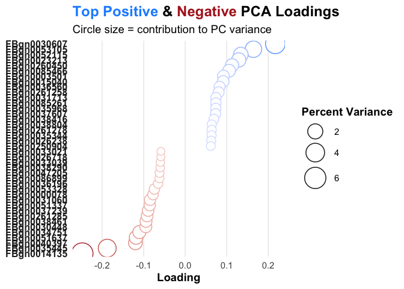

This vignette will show the basic use-cases for `RGenEDA` on bulk RNASeq
data, however, the package can be easily used for other types of omics
data as long as a counts matrix and metadata are present.

We will rely on data in the `pasilla` dataset and follow the [deseq2
framework](https://www.bioconductor.org/packages/devel/bioc/vignettes/DESeq2/inst/doc/DESeq2.html)

    # Load libraries
    suppressPackageStartupMessages({
      library(RGenEDA)
      library(pasilla)
      library(tidyverse)
      library(ggplot2)
      library(ggtext)
    })

We first load in our data. In the case of your own data, you can use
`read_csv`, `fread`, or your favorite table reader function to load your
counts matrix. We will quickly explore the first few rows of the data.

    # Set path to pasilla data
    datafile <-  system.file( "extdata/pasilla_gene_counts.tsv", package="pasilla" )

    # Load counts
    count.table <-  read.table( datafile, header=TRUE, row.names=1, quote="", comment.char="" )
    head(count.table)
    #>             untreated1 untreated2 untreated3 untreated4 treated1 treated2 treated3
    #> FBgn0000003          0          0          0          0        0        0        1
    #> FBgn0000008         92        161         76         70      140       88       70
    #> FBgn0000014          5          1          0          0        4        0        0
    #> FBgn0000015          0          2          1          2        1        0        0
    #> FBgn0000017       4664       8714       3564       3150     6205     3072     3334
    #> FBgn0000018        583        761        245        310      722      299      308

We need to gather the metadata associated with these samples. In the
case of the `pasilla` dataset, we have two major variables: `cond.type`
and `lib.type` which we will explore. It is always a good practice to
ensure that your samples are not scrambled between your counts matrix
and metadata table.

    cond.type <-  c( "untreated", "untreated", "untreated","untreated", "treated", "treated", "treated" )
    lib.type   <-  c( "single-end", "single-end", "paired-end", "paired-end", "single-end", "paired-end", "paired-end" ) 

    metadata <- data.frame(condition = cond.type,
                           library = lib.type)
    rownames(metadata) <- colnames(count.table)

Now, we can create a DESeq2 object using our counts and metadata. We
pre-filter the counts data to remove lowly expressed genes and run
DESeq2. We variance stabalize transform the counts to prepre for
exploratory data analysis. `rlog` transformation can be used here if
preferred.

    # Create a DESeq2 dataset
    dds <- DESeqDataSetFromMatrix(countData = count.table,
                                  colData = metadata,
                                  design = ~condition + library + condition:library)
    #> Warning in DESeqDataSet(se, design = design, ignoreRank): some variables in design formula are characters, converting to factors
    #>   Note: levels of factors in the design contain characters other than
    #>   letters, numbers, '_' and '.'. It is recommended (but not required) to use
    #>   only letters, numbers, and delimiters '_' or '.', as these are safe characters
    #>   for column names in R. [This is a message, not a warning or an error]

    # Set reference levels
    dds$condition <- relevel(dds$condition, ref = "untreated")
    dds$library <- relevel(dds$library, ref = "single-end")

    # Pre filter
    smallestGroupSize <- 3
    keep <- rowSums(counts(dds) >= 10) >= smallestGroupSize
    dds <- dds[keep,]

    # Run DESeq2
    dds <- DESeq(dds)
    #> estimating size factors
    #>   Note: levels of factors in the design contain characters other than
    #>   letters, numbers, '_' and '.'. It is recommended (but not required) to use
    #>   only letters, numbers, and delimiters '_' or '.', as these are safe characters
    #>   for column names in R. [This is a message, not a warning or an error]
    #> estimating dispersions
    #> gene-wise dispersion estimates
    #> mean-dispersion relationship
    #>   Note: levels of factors in the design contain characters other than
    #>   letters, numbers, '_' and '.'. It is recommended (but not required) to use
    #>   only letters, numbers, and delimiters '_' or '.', as these are safe characters
    #>   for column names in R. [This is a message, not a warning or an error]
    #> final dispersion estimates
    #> fitting model and testing

    # Variance stabilizing transform
    vsd <- vst(dds)

    # Extract matrix
    mat <- assay(vsd)

Now that we successfully have a matrix and metadata, we are ready to
start exploratory data analysis. Let’s start by looking at the sample
distances to see how our samples are clustering. For `RGenEDA` it is
useful to set a figure directory where all EDA plots will live. We want
to visualize all possible metadata for this.

    # Set output directory
    outputDir <- c("/users/mike/Desktop/RGenEDA/img/")

    # Set colors for our metadata categories
    metaColors <- list(condition = c("untreated" = "blue",
                                     "treated" = "red"),
                       library = c("single-end" = "maroon",
                                   "paired-end" = "gold"))

    # Call the distance heatmap function
    distanceHeatmap(MAT = mat,
                    META = metadata,
                    FEATURES = c("condition", "library"),
                    PALETTES = metaColors,
                    OUTPUT = outputDir)
    #> Transposing data matrix...
    #> Extracting condition as features for plotting...Extracting library as features for plotting...
    #> Saving distance heatmap to /users/mike/Desktop/RGenEDA/img/
    #> Distance heatmap successfully generated!

    knitr::include_graphics(file.path(outputDir, "Sample_Distance_HM.tiff"))

    # Explore variance
    variance <- plotVariance(MAT = mat,
                             OUTPUT = outputDir,
                             LOG = FALSE,
                             nFeaturesDrop = NULL)
    #> Calculating variance on 8148 x 7 matrix...

    # Generate PCs
    pcaRes <- generatePCs(MAT = mat,
                          VARS = variance,
                          NFEATURES = 2000)
    #> Running PCA on 2000 most variable features...
    #> Percent variations:
    #>       PC1       PC2       PC3       PC4       PC5 
    #> "45.35 %" "29.18 %"  "15.5 %"  "5.17 %"     "3 %"

    # Extract PC data
    pcaDF <- as.data.frame(pcaRes[["Loadings"]])

    # Append metadata to pcaDF
    pcaDF <- cbind(pcaDF, metadata)

    # Plot PCA

Eigencorrelations can be used to assess what metadata features are
strongly correlated with major axes of variation in the data.
`eigencorr` produces a list of 3, including the correlation matrix, the
p-value matrix, and the significance stars such that three stars &lt;
0.001, two stars &lt; 0.01, and one star &lt; 0.05. No Star indicates no
significance.

    # Use Eigencorrelations
    eigenRes <- eigencorr(MAT = mat,
              META = metadata,
              NUM_PCS = 4,
              OUTPUT = outputDir)
    #> Output path: /users/mike/Desktop/RGenEDA/img/EigenCorrelations.tiff
    #> Plotting heatmap...
    #> Plotting complete!

    eigenRes[[""]]
    #> NULL

    knitr::include_graphics(file.path(outputDir, "EigenCorrelations.tiff"))

After finding principal components that correlate with metadata features
of interest, we can then explore the loadings for that particular
principal component using the variances and pca results calculated above
from `plotVariance` and `generatePCs`, respectively. We specify PC1 as
the component of interest and provide the same number of features we
used to calculate out principal components. This function returns a
dataframe of the gene, its loading, and the percentage of variation it
contributes to the particular component specified. We can use these
loadings to plot figures showing the gene contributions.

    PC1_loadings <- extractLoadings(variance = variance, 
                                    pcRes = pcaRes,
                                    component = "PC1",
                                    nfeatures = 2000)

    # Specify number of genes to take from top and bottom of loadings
    top_n <- 20
    df_plot <- PC1_loadings %>%
      arrange(desc(Loading)) %>% slice(1:top_n) %>%
      bind_rows(PC1_loadings %>% arrange(Loading) %>% slice(1:top_n)) %>%
      mutate(Direction = ifelse(Loading > 0, "Positive", "Negative"),
             Gene = fct_reorder(Gene, Loading))  

    # Plot
    ggplot(df_plot, aes(x = Gene, y = Loading, color = Loading, size = PercentVariance)) +
      geom_point(alpha = 0.9, shape = 21, stroke = 0.8, fill = "white", show.legend = c(size = TRUE, color = FALSE)) +
      scale_color_gradient2(low = "firebrick", mid = "white", high = "dodgerblue", midpoint = 0, guide = "none") +
      scale_size_continuous(range = c(4, 12)) +
      coord_flip() +
      theme_minimal(base_size = 14) +
      theme(
        axis.text.y = element_text(face = "bold", size = 12, color = "#222222"),
        axis.title = element_text(size = 14, face = "bold"),
        panel.grid.major.y = element_blank(),
        panel.grid.minor = element_blank(),
        panel.grid.major.x = element_line(color = "#eeeeee"),
        plot.title = element_markdown(face = "bold", size = 18),
        plot.subtitle = element_markdown(size = 14),
        legend.position = "right",
        legend.title = element_text(face = "bold")
      ) +
      labs(
        title = "Top Positive & Negative PCA Loadings",
        subtitle = "Circle size = contribution to PC variance",
        x = NULL,
        y = "Loading",
        size = "Percent Variance"
      )

After our exploration, we can examine our differential expression
results using an MA plot.

    # Extract DESeq2 results
    resultsNames(dds)
    #> [1] "Intercept"                          "condition_treated_vs_untreated"     "library_paired.end_vs_single.end"  
    #> [4] "conditiontreated.librarypaired.end"
    results <- as.data.frame(results(dds, name = "condition_treated_vs_untreated"))

    x <- MAplot(results = results,
           numerator = "treated",
           refLevel = "untreated",
           log2FC_thresh = 1,
           padj_thresh = 0.05,
           title = "MA_demo",
           figDir = outputDir,
           "MAplotDemo.png")
    #> Ignoring unknown labels:
    #> • colour : ""
    #> Warning: Removed 474 rows containing missing values or values outside the scale range (`geom_point()`).
    #> Warning: Removed 84 rows containing missing values or values outside the scale range (`geom_point()`).
    #> Plotted /users/mike/Desktop/RGenEDA/img/MAplotDemo.png
