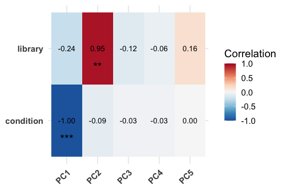

This vignette will show the basic use-cases for `RGenEDA` on bulk RNASeq
data, however, the package can be easily used for other types of omics
data as long as a counts matrix and metadata are present.

We will rely on data in the `pasilla` dataset and follow the [deseq2
framework](https://www.bioconductor.org/packages/devel/bioc/vignettes/DESeq2/inst/doc/DESeq2.html)

    #----- Load libraries
    suppressPackageStartupMessages({
      library(RGenEDA)
      library(pasilla)
      library(tidyverse)
      library(ggplot2)
      library(ggtext)
    })

We first load in our data. In the case of your own data, you can use
`read_csv`, `fread`, or your favorite table reader function to load your
counts matrix. We will quickly explore the first few rows of the data.

    #----- Set path to pasilla data
    datafile <-  system.file( "extdata/pasilla_gene_counts.tsv", package="pasilla" )

    #----- Load counts
    count.table <-  read.table( datafile, header=TRUE, row.names=1, quote="", comment.char="" )
    head(count.table)
    #>             untreated1 untreated2 untreated3 untreated4 treated1 treated2 treated3
    #> FBgn0000003          0          0          0          0        0        0        1
    #> FBgn0000008         92        161         76         70      140       88       70
    #> FBgn0000014          5          1          0          0        4        0        0
    #> FBgn0000015          0          2          1          2        1        0        0
    #> FBgn0000017       4664       8714       3564       3150     6205     3072     3334
    #> FBgn0000018        583        761        245        310      722      299      308

We need to gather the metadata associated with these samples. In the
case of the `pasilla` dataset, we have two major variables: `cond.type`
and `lib.type` which we will explore. It is always a good practice to
ensure that your samples are not scrambled between your counts matrix
and metadata table.

We will also set a list of color vectors for our metadata which will be
useful in downstream functions.

    #----- Metadata building
    cond.type <-  c( "untreated", "untreated", "untreated","untreated", "treated", "treated", "treated" )
    lib.type   <-  c( "single-end", "single-end", "paired-end", "paired-end", "single-end", "paired-end", "paired-end" ) 
    meta <- data.frame(condition = cond.type,
                       library = lib.type)
    rownames(meta) <- colnames(count.table)

    #----- Set color vector list
    colorList <- list(condition= c("untreated" = "red",
                                    "treated" = "blue"),
                      library = c("single-end" = "orange",
                                   "paired-end" = "green"))

Now, we can create a DESeq2 object using our counts and metadata. We
pre-filter the counts data to remove lowly expressed genes and run
DESeq2. We variance stabalize transform the counts to prepre for
exploratory data analysis. `rlog` transformation can be used here if
preferred.

    #----- Create a DESeq2 dataset
    dds <- DESeqDataSetFromMatrix(countData = count.table,
                                  colData = meta,
                                  design = ~condition + library + condition:library)
    #> Warning in DESeqDataSet(se, design = design, ignoreRank): some variables in design formula are characters, converting to factors
    #>   Note: levels of factors in the design contain characters other than
    #>   letters, numbers, '_' and '.'. It is recommended (but not required) to use
    #>   only letters, numbers, and delimiters '_' or '.', as these are safe characters
    #>   for column names in R. [This is a message, not a warning or an error]

    #----- Set reference levels
    dds$condition <- relevel(dds$condition, ref = "untreated")
    dds$library <- relevel(dds$library, ref = "single-end")

    #----- Pre filter
    smallestGroupSize <- 3
    keep <- rowSums(counts(dds) >= 10) >= smallestGroupSize
    dds <- dds[keep,]

    #----- Run DESeq2
    dds <- DESeq(dds)
    #> estimating size factors
    #>   Note: levels of factors in the design contain characters other than
    #>   letters, numbers, '_' and '.'. It is recommended (but not required) to use
    #>   only letters, numbers, and delimiters '_' or '.', as these are safe characters
    #>   for column names in R. [This is a message, not a warning or an error]
    #> estimating dispersions
    #> gene-wise dispersion estimates
    #> mean-dispersion relationship
    #>   Note: levels of factors in the design contain characters other than
    #>   letters, numbers, '_' and '.'. It is recommended (but not required) to use
    #>   only letters, numbers, and delimiters '_' or '.', as these are safe characters
    #>   for column names in R. [This is a message, not a warning or an error]
    #> final dispersion estimates
    #> fitting model and testing

    #----- Variance stabilizing transform
    vsd <- vst(dds)

    #----- Extract matrix
    mat <- assay(vsd)

Now that we successfully have a matrix and metadata, we are ready to
start exploratory data analysis. To begin, we create a `GenEDA` object
which requires the following slots: normalized counts, which can be
obtained through variance stabilizing transformation as shown above, or
`rlog` and metadata.

Raw counts can also be provided. Additional slots (`HVGs`,
`DimReduction`, and `DEGs` will be filled later.)

    #----- Create new GenEDA object
    obj <- GenEDA(normalized = mat,
                  metadata = meta,
                  counts = as.matrix(count.table))

    #----- Visualize the object
    obj
    #> geneda object
    #>   features: 8148
    #>   samples:  7
    #>   HVGs: 0
    #>   counts: present

    #----- Visualize the structure of the object
    str(obj)
    #> Formal class 'geneda' [package "RGenEDA"] with 6 slots
    #>   ..@ counts      : int [1:14599, 1:7] 0 92 5 0 4664 583 0 10 0 1446 ...
    #>   .. ..- attr(*, "dimnames")=List of 2
    #>   .. .. ..$ : chr [1:14599] "FBgn0000003" "FBgn0000008" "FBgn0000014" "FBgn0000015" ...
    #>   .. .. ..$ : chr [1:7] "untreated1" "untreated2" "untreated3" "untreated4" ...
    #>   ..@ normalized  : num [1:8148, 1:7] 7.39 12.03 9.25 6.27 10.41 ...
    #>   .. ..- attr(*, "dimnames")=List of 2
    #>   .. .. ..$ : chr [1:8148] "FBgn0000008" "FBgn0000017" "FBgn0000018" "FBgn0000024" ...
    #>   .. .. ..$ : chr [1:7] "untreated1" "untreated2" "untreated3" "untreated4" ...
    #>   ..@ metadata    :'data.frame': 7 obs. of  2 variables:
    #>   .. ..$ condition: chr [1:7] "untreated" "untreated" "untreated" "untreated" ...
    #>   .. ..$ library  : chr [1:7] "single-end" "single-end" "paired-end" "paired-end" ...
    #>   ..@ HVGs        : chr(0) 
    #>   ..@ DimReduction: list()
    #>   ..@ DEGs        :List of 2
    #>   .. ..$ unfiltered: NULL
    #>   .. ..$ filtered  : NULL

Let’s first see how our replicates compare to one another. We can
visualize this by using Euclidean distances paired with hierarchical
clustering. The `distanceHeatmap` function plots sample-to-sample
distances such that darker colors are more similar and lighter colors
are more dissimilar. This helps to assess replicate quality as well as
metadata features that seem to drive clustering. This function returns
either the object, or the plot itself. Any number of metadata categories
can be passed along with the associated color vectors.

    #----- Plot Eucliden distances
    distanceHeatmap(obj,
                    meta_cols = c("condition", "library"),
                    palettes = colorList,
                    return = "plot")
    #> $dist_matrix
    #>            untreated1 untreated2 untreated3 untreated4 treated1 treated2 treated3
    #> untreated1    0.00000   23.79029   27.09868   23.15426 29.81576 31.50636 32.64211
    #> untreated2   23.79029    0.00000   22.41260   22.70132 27.14208 32.20063 32.90292
    #> untreated3   27.09868   22.41260    0.00000   16.52356 34.83473 27.50385 28.02457
    #> untreated4   23.15426   22.70132   16.52356    0.00000 33.66466 25.48474 24.93390
    #> treated1     29.81576   27.14208   34.83473   33.66466  0.00000 25.50747 27.12965
    #> treated2     31.50636   32.20063   27.50385   25.48474 25.50747  0.00000 11.13938
    #> treated3     32.64211   32.90292   28.02457   24.93390 27.12965 11.13938  0.00000
    #> 
    #> $order
    #> [1] "untreated1" "untreated2" "untreated3" "untreated4" "treated1"   "treated2"   "treated3"  
    #> 
    #> $heatmap
    #> 
    #> $palettes
    #> $palettes$condition
    #> untreated   treated 
    #>     "red"    "blue" 
    #> 
    #> $palettes$library
    #> single-end paired-end 
    #>   "orange"    "green"

To begin, we assess the variance profile of our data. This will give us
an idea of how many genes are highly variable. This information will
inform how principal components are calculated downstream. This can be
done one of two ways: `plotHVGVariance` will plot an elbow curve for
each gene, ranked by decreasing variance. This is a subjective way to
pick a number of highly variable genes (HVGs). We can also use
`FindVariableFeatures` directly by providing a number of genes to use,
again ranked by decreasing variance. Once calculated, HVGs (gene names)
will be stores in the `HVGs` slot of the object.

    #----- Plot variance profile
    plotHVGVariance(obj)

Based on our plot, it appears that 2000 variable features should be
sufficient to capture the breadth of variation in our data. We can add
these HVGs to out object using the `FindVariableFeatures` function
specifying the top 2000 features.

    #----- Add HVGs to object
    obj <- FindVariableFeatures(obj, 2000)

    #----- View the HVGs
    head(HVGs(obj))
    #> [1] "FBgn0039155" "FBgn0029856" "FBgn0003360" "FBgn0053909" "FBgn0085787" "FBgn0025111"

We can use these HVGs to calculate the principal components of our
dataset using the `RunPCA` function. If `FindVariableFeatures` was not
ran beforehand, `RunPCA` will calculate HVGs by default with 2000
features. This argument can be overriden using the `nfeatures` argument.
The PCA results will be stored in the `DimReduction` slot of the object
as a list containing 3 elements: `$Loadings` holding the PCA loadings
for each sample, `$Eigenvectors` holding the per-gene loadings for each
PC, and `$percent_var` containing the percent variation explained by the
top 5 principal components.

Since we have already selected HVGs, we can run `RunPCA` on our object
directly and grab the results.

    #----- Calculate PCA
    obj <- RunPCA(obj)
    #> Calculating principal components from top 2000 HVGs
    #> Percent variations:
    #>       PC1       PC2       PC3       PC4       PC5 
    #> "45.35 %" "29.18 %"  "15.5 %"  "5.17 %"     "3 %"

    #----- Visualize the results
    head(obj@DimReduction$Loadings)
    #>                  PC1       PC2        PC3        PC4        PC5          PC6          PC7
    #> untreated1 -5.244188  3.267803 -7.3173995  0.8956240  0.6560211  0.263014919 4.443147e-14
    #> untreated2 -5.741324  4.054147  4.4148996 -1.6852478  2.2255095 -0.157432838 4.412048e-14
    #> untreated3 -5.300851 -4.045810  3.1725971  3.6410897 -0.7680523  0.555854065 4.431683e-14
    #> untreated4 -4.404109 -4.693799 -0.6643761 -3.0558063 -2.1096526 -0.686050207 4.444540e-14
    #> treated1    5.941176  8.466444  1.4317275  0.3751014 -2.0255952 -0.006515056 4.370513e-14
    #> treated2    7.325773 -3.284794 -0.6180029  0.9908693  1.2177454 -2.128977372 4.237626e-14
    head(obj@DimReduction$Eigenvectors)
    #>                       PC1          PC2           PC3          PC4          PC5
    #> FBgn0011764 -0.0001939999  0.011784784 -0.0002716843  0.026109530 -0.036764223
    #> FBgn0002441 -0.0050539094 -0.005417428 -0.0025994524  0.005128475  0.017970971
    #> FBgn0001276 -0.0037799827  0.012863950  0.0022284691 -0.053304421  0.009856952
    #> FBgn0025864  0.0069592766 -0.034519739 -0.0074099283  0.033151524  0.009045152
    #> FBgn0000063  0.0140917988  0.012765500 -0.0057142017 -0.007164571  0.024494828
    #> FBgn0023507 -0.0248617605 -0.051313236 -0.0154158330  0.016058148 -0.023410164
    head(obj@DimReduction$percent_var)
    #>       PC1       PC2       PC3       PC4       PC5 
    #> "45.35 %" "29.18 %"  "15.5 %"  "5.17 %"     "3 %"

We can access the PCA results and merge with metadata for downstream
plotting using the utility function `ExtractPCA`. Note, a PCA plotting
function is in the works, of which an argument `returnData` will be used
to run this utility function under the hood. This can be used directly
to facilitate more complex, customizable figure plotting.

    #----- Extract PCA results with metadata as a dataframe
    pcaDF <- ExtractPCA(obj)

    #----- Visualize results
    colnames(pcaDF)
    #> [1] "PC1"       "PC2"       "PC3"       "PC4"       "PC5"       "PC6"       "PC7"       "condition" "library"

We can then correlate principal components, which represent major axes
of variation, with metadata features through eigenvector correlation
plots. The function `eigencorr` uses Pearson correlations to assess
significant correlations and plots a heatmap showing these correlations.
By default, the principal components from the `DimReduction` slot are
used. Any metadata features can be specified using the `meta_cols`
argument. By default, all metadata columns will be used. This function
returns a list of 4 elements: `cor_matrix` with the Pearson correlation
values, `pval_matrix` holding the associated p-values, `stars` holding
the star encodings based on significance, and `plot` (ggplot object.)

Here, we will correlate our metadata with the first 5 PCs.

    #----- Plot eigenvector correlations
    ec <- eigencorr(obj,
                    num_pcs = 5)

    #----- Visualize the plot
    ec$plot

MORE TO COME…. RGenEDA is in active development!
