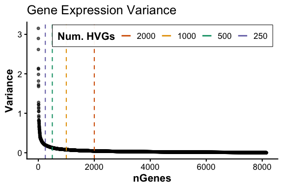

# Overview

`RGenEDA` is designed to provide a unified, reproducible framework for
exploratory data analysis across multiple omics data types.

This vignette introduces the `RGenEDA` package using bulk RNA-seq data
from the pasilla dataset. `RGenEDA` facilitates Exploratory Data
Analysis (EDA) for any omics dataset, provided a counts matrix and
metadata are available.

We’ll follow a simplified version of the [deseq2
framework](https://www.bioconductor.org/packages/devel/bioc/vignettes/DESeq2/inst/doc/DESeq2.html)
for normalization and use RGenEDA’s functionality to assess variance
structure, dimensionality reduction, and sample relationships.

## Table of contents

-   [Load and inspect the data](#load-and-inspect-the-data)
-   [Define metadata](#define-metadata)
-   [Processing and normalization](#processing-and-normalization)
-   [Create a GenEDA object](#create-a-geneda-object)
-   [Count distrubutions across
    samples](#count-distributions-across-samples)
-   [Sample Eucliden distances with hierarchical
    clustering](#sample-euclidean-distances-with-hierarchical-clustering)
-   [Identify highly variable genes](#identify-highly-variable-genes)
-   [Principal component analysis](#principal-component-analysis)
-   [Extract and visualize PCA
    results](#extract-and-visualize-pca-results)
-   [Explore Eigen vectors of individual
    PCs](#explore-eigen-vectors-of-individual-pcs)
-   [Correlate PCs with metadata](#correlate-pcs-with-metadata)
-   [Explore DEGs](#explore-degs)

## Load and inspect the data

We begin by loading the `pasilla` dataset, which contains gene-level
RNA-seq counts for *Drosophila melanogaster*. For your own data, you can
use `read_csv()` or `fread()` to import counts from a tabular file.

    datafile <-  system.file( "extdata/pasilla_gene_counts.tsv", package="pasilla" )
    count.table <-  read.table( datafile, header=TRUE, row.names=1, quote="", comment.char="" )
    head(count.table)
    #>             untreated1 untreated2 untreated3 untreated4 treated1 treated2 treated3
    #> FBgn0000003          0          0          0          0        0        0        1
    #> FBgn0000008         92        161         76         70      140       88       70
    #> FBgn0000014          5          1          0          0        4        0        0
    #> FBgn0000015          0          2          1          2        1        0        0
    #> FBgn0000017       4664       8714       3564       3150     6205     3072     3334
    #> FBgn0000018        583        761        245        310      722      299      308

## Define metadata

Next, we define the associated sample metadata. In `pasilla`, samples
differ by treatment (condition) and library type (single-end or
paired-end).

    # Set metadata
    cond.type <- c("untreated", "untreated", "untreated", "untreated",
                   "treated", "treated", "treated")
    lib.type  <- c("single-end", "single-end", "paired-end", "paired-end",
                   "single-end", "paired-end", "paired-end")

    # Create metadata dataframe
    meta <- data.frame(
      condition = cond.type,
      library = lib.type
    )
    rownames(meta) <- colnames(count.table)

    # Color palettes for plotting
    colorList <- list(
      condition = c("untreated" = "#E41A1C", "treated" = "#377EB8"),
      library   = c("single-end" = "#FF7F00", "paired-end" = "#4DAF4A")
    )

    head(meta)
    #>            condition    library
    #> untreated1 untreated single-end
    #> untreated2 untreated single-end
    #> untreated3 untreated paired-end
    #> untreated4 untreated paired-end
    #> treated1     treated single-end
    #> treated2     treated paired-end

## Processing and normalization

We next build a `DESeqDataSet` and perform variance-stabilizing
transformation (VST) for downstream EDA. Lowly expressed genes are
filtered out before running `DESeq2.`

    dds <- DESeqDataSetFromMatrix(
      countData = count.table,
      colData = meta,
      design = ~ condition + library + condition:library
    )
    #> Warning in DESeqDataSet(se, design = design, ignoreRank): some variables in design formula are characters, converting to factors

    # Set reference levels
    dds$condition <- relevel(dds$condition, ref = "untreated")
    dds$library <- relevel(dds$library, ref = "single-end")

    # Prefilter: keep genes with at least 10 counts in  at least 3 samples
    keep <- rowSums(counts(dds) >= 10) >= 3
    dds <- dds[keep,]

    # Run DESeq2
    dds <- DESeq(dds)

    # Variance-stabilizing transform
    vsd <- vst(dds)
    mat <- assay(vsd)

## Create a GenEDA object

With the normalized counts and metadata prepared, we can create a
`GenEDA` object. This object will store all components of your analysis,
from normalized data and metadata (bare minimum requirements) to PCA and
HVG results (downstream.) Raw counts passed to `DESeq2` can optionally
be stored.

    obj <- GenEDA(
      normalized = mat,
      metadata = meta)

    # View object summary
    obj
    #> geneda object
    #>   features: 8148
    #>   samples:  7
    #>   HVGs: 0
    #>   counts: NULL
    #>   DEGs: NULL

## Count distributions across samples

To visualize normalized count distributions across samples, the
`PlotCountDist` function can be used. This is a helpful way to visualize
effectiveness of normalization, as the overall distributions should be
similar across samples. Samples with very low or very high overall
counts compared to others might indicate problematic samples, technical
artifacts, or batch effect.

    PlotCountDist(obj, split_by = "condition")

## Sample Eucliden distances with hierarchical clustering

To visualize replicate similarity, we can plot Euclidean distances
between samples using the `distanceHeatmap` function. Darker colors
indicate higher similarity, while lighter colors represent dissimilar
samples. This provides a quick assessment of replicate quality and
metadata features that drive clustering. To save heatmaps that are
derived from `pheatmap`, we can use the `GenSave` function, which is
similar in function to `ggsave`.

    hm <- distanceHeatmap(
      obj,
      meta_cols = c("condition", "library"),
      palettes = colorList,
      return = "plot"
    )
    hm$heatmap

    # GenSave(hm, "/path/to/EuclidenDistance_Heatmap.png", width = 6, height = 8)

## Identify highly variable genes

Next, we assess variance across all genes to identify those most
variable across samples as these drive much of the biological signal.
You can visualize the full variance profile for all genes profiled with
`plotHVGVariance`.

    #----- Plot variance profile
    PlotHVGVariance(obj)

Based on the plot, we’ll retain the top 2,000 most variable genes using
`FindVariableFeatures` which stores the gene names in the HVGs slot of
the `GenEDA` object

    #----- Add HVGs to object
    obj <- FindVariableFeatures(obj, 2000)
    head(HVGs(obj))
    #> [1] "FBgn0039155" "FBgn0029856" "FBgn0003360" "FBgn0053909" "FBgn0085787" "FBgn0025111"

## Principal component analysis

Using the identified HVGs, we perform PCA with `RunPCA`. This function
stores PCA results in the DimReduction slot, including:

• `$Loadings` (sample scores)

• `$Eigenvectors` (gene contributions)

• `$percent_var` (Percent variance explained per component, up to PC5)

If `FindVariableFeatures` was not ran beforehand, `RunPCA` will
calculate HVGs by default with 2000 features. This argument can be
overriden using the `nfeatures` argument.

    obj <- RunPCA(obj)
    #> Calculating principal components from top 2000 HVGs
    #> Percent variations:
    #>       PC1       PC2       PC3       PC4       PC5 
    #> "45.35 %" "29.18 %"  "15.5 %"  "5.17 %"     "3 %"

    # Inspect PCA outputs
    head(obj@DimReduction$Loadings)
    #>                  PC1       PC2        PC3        PC4        PC5          PC6          PC7
    #> untreated1 -5.244188  3.267803 -7.3173995  0.8956240  0.6560211  0.263014919 4.443147e-14
    #> untreated2 -5.741324  4.054147  4.4148996 -1.6852478  2.2255095 -0.157432838 4.412048e-14
    #> untreated3 -5.300851 -4.045810  3.1725971  3.6410897 -0.7680523  0.555854065 4.431683e-14
    #> untreated4 -4.404109 -4.693799 -0.6643761 -3.0558063 -2.1096526 -0.686050207 4.444540e-14
    #> treated1    5.941176  8.466444  1.4317275  0.3751014 -2.0255952 -0.006515056 4.370513e-14
    #> treated2    7.325773 -3.284794 -0.6180029  0.9908693  1.2177454 -2.128977372 4.237626e-14
    head(obj@DimReduction$Eigenvectors)
    #>                       PC1          PC2           PC3          PC4          PC5
    #> FBgn0011764 -0.0001939999  0.011784784 -0.0002716843  0.026109530 -0.036764223
    #> FBgn0002441 -0.0050539094 -0.005417428 -0.0025994524  0.005128475  0.017970971
    #> FBgn0001276 -0.0037799827  0.012863950  0.0022284691 -0.053304421  0.009856952
    #> FBgn0025864  0.0069592766 -0.034519739 -0.0074099283  0.033151524  0.009045152
    #> FBgn0000063  0.0140917988  0.012765500 -0.0057142017 -0.007164571  0.024494828
    #> FBgn0023507 -0.0248617605 -0.051313236 -0.0154158330  0.016058148 -0.023410164
    head(obj@DimReduction$percent_var)
    #>       PC1       PC2       PC3       PC4       PC5 
    #> "45.35 %" "29.18 %"  "15.5 %"  "5.17 %"     "3 %"

## Extract and visualize PCA results

You can easily extract PCA results merged with metadata using
`ExtractPCA`. This enables flexible downstream visualization with
ggplot2 or other frameworks.

To quickly plot PCA results, the `PlotPCA` function can be used.

    pcaDF <- ExtractPCA(obj)
    head(pcaDF)
    #>                  PC1       PC2        PC3        PC4        PC5          PC6          PC7 condition    library
    #> untreated1 -5.244188  3.267803 -7.3173995  0.8956240  0.6560211  0.263014919 4.443147e-14 untreated single-end
    #> untreated2 -5.741324  4.054147  4.4148996 -1.6852478  2.2255095 -0.157432838 4.412048e-14 untreated single-end
    #> untreated3 -5.300851 -4.045810  3.1725971  3.6410897 -0.7680523  0.555854065 4.431683e-14 untreated paired-end
    #> untreated4 -4.404109 -4.693799 -0.6643761 -3.0558063 -2.1096526 -0.686050207 4.444540e-14 untreated paired-end
    #> treated1    5.941176  8.466444  1.4317275  0.3751014 -2.0255952 -0.006515056 4.370513e-14   treated single-end
    #> treated2    7.325773 -3.284794 -0.6180029  0.9908693  1.2177454 -2.128977372 4.237626e-14   treated paired-end

    # Plot PCA
    PlotPCA(object = obj,
            x = 1,
            y = 2,
            color_by = "condition",
            colors = c("untreated" = "red", "treated" = "blue"),
            shape_by = "library")

\## Explore Eigen vectors of individual PCs

We can explore the individual Eigen vectors that comprise a particular
component of interest (usually PC1 and PC2) using `extractEigen`.

Similarly, to visually explore the top Eigen vectors, the
`PlotEigenHeatmap` function can be ran directly. Heatmap values are the
normalized expression values scaled and Z-scored.

    pc1_eigen <- extractEigen(object = obj,
                              component = "PC1")
    head(pc1_eigen)
    #>          Gene   EigenVector       PctVar
    #> 1 FBgn0011764 -0.0001939999 3.763595e-06
    #> 2 FBgn0002441 -0.0050539094 2.554200e-03
    #> 3 FBgn0001276 -0.0037799827 1.428827e-03
    #> 4 FBgn0025864  0.0069592766 4.843153e-03
    #> 5 FBgn0000063  0.0140917988 1.985788e-02
    #> 6 FBgn0023507 -0.0248617605 6.181071e-02

    hm2 <- PlotEigenHeatmap(obj,
                     pc = "PC1",
                     n = 25,
                     annotate_by = "condition",
                     annotate_colors = list(condition = c("untreated" = "red", 
                                                                "treated" = "blue")))
    hm2$heatmap

    # GenSave(hm2, "/path/to/EuclidenDistance_Heatmap.png", width = 6, height = 8)

## Correlate PCs with metadata

To interpret principal components, we can correlate them with sample
metadata using `eigencorr`. This function computes Pearson correlations
and displays them as a heatmap, helping to reveal which metadata
features are most associated with major axes of variation. This function
returns a list of 4 elements:

• `$cor_matrix` (Pearson correlation values)

• `$pval_matrix` (Associated correlation p-values)

• `$stars` (asterisk representations of p-values)

• `$plot` (Eigencorr plot, as a `ggplot2` object, which can be saved
with `ggsave`)

**Note:** `ordcorr` can be used for microbiome data as it correlates
metadata features with NMDS beta values rather than PCs.

    ec <- eigencorr(obj, num_pcs = 5)
    ec$plot

## Explore DEGs

We can also explore the differentially expressed genes by appending
these to our object. We can also quickly filter out data and save it as
a new DEG slot.

Note: multiple DEG assays can be appended to the DEGs slot by passing an
assay name in the `SetDEGs` command (for example, raw DESeq2 results and
Shrunk DESeq2 results.)

    res <- results(dds) |> 
      as.data.frame()

    obj <- SetDEGs(obj, res, "unfiltered")
    obj <- FilterDEGs(obj,
                      assay = "unfiltered",
                      padj_thresh = 0.05,
                      log2FC_thresh = 1,
                      saveAssay = "padj05_lfc1")

We can plot some basic visualizations such as MA plots

    PlotMA(obj,
           assay = "unfiltered",
           alpha = 0.05,
           fc = 1)
    #> Scale for size is already present.
    #> Adding another scale for size, which will replace the existing scale.

Or a volcano plot by specifying numerator and denominator (denominator
is your comparison reference level).

    PlotVolcano(obj,
           assay = "unfiltered", 
           alpha = 0.05,
           fc = 1,
           den = "untreated",
           num = "treated",
           title = "Example Volcano")

